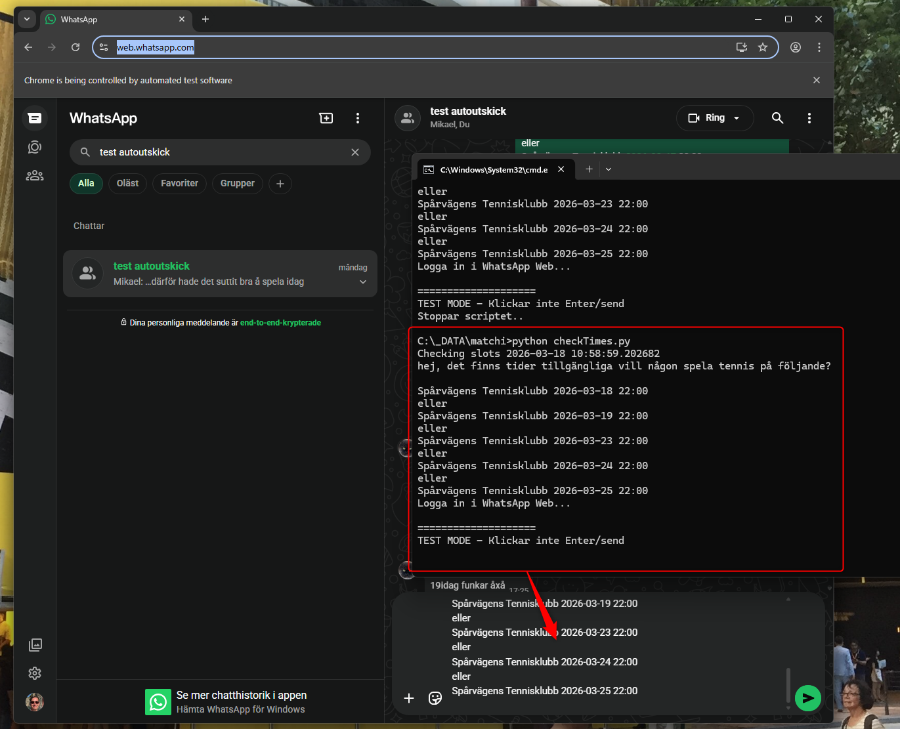

# Matchi Tennis/Padel/Sqush/Badminton webscraper och push till polare

Automatiskt script som:
- söker lediga tennistider (eller padel, går att ändra i script) via Matchi
- söker de klubbar som är intressanta för dig att leta i, ändra detta i script. använd samma stavning som matchi!
- filtrerar kvällstider, detta går att ändra till de tider som passar dig/er. Filtrerar även så den endast letar på mån-tors, detta kan du själv justera i scriptet såklart
- letar endast 7 dagar framåt då de klubbar jag har endast släpper tider för 7 dagar framåt, detta kan du också ändra..
- skickar notis via WhatsApp Web

---

## Funktioner

- "Scraping" av Matchi API
- WhatsApp automation via Selenium
- Test mode (skickar inget, sparar inget)
- behåller chrome session (slipp QR-login varje gång, och kan ha det på i bakgrunden)
- schemaläggning efter önskemål

---

## Information kring setup
För att köra så behöver du installera de bibliotek som behövs manuellt eller via requirements.txt:
1. requests & requirements för matchi scraping
2. selenium för automatiserat whatsapputskick
3. schedule för schemaläggning
4. Första gången du kör scriptet så behöver du ha mobilen redo att logga in med QR koden
5. efter du loggat in kan du köra scriptet igen och denna gången så kommer den (förhoppningsvis) lyckas hitta chatten och skriva meddelandet
6. när du är nöjd med vad den hittar och meddelandet så kan du ändra till "TEST_MODE = False"
7. nu kan den vara igång i bakgrunden av din dator så körs den automatiskt. OBS! har problem med headerless (chrome är osynlig och körs som dold process) och behålla sessionen så för nu så måste den poppa upp för datorn/servern som kör scriptet. 

---

## Saker att justera i scriptet!!

1. TEST_MODE - true/false
2. FACILITIES - alla som du vill söka igenom efter tider, exakt namn från match
3. GROUP_NAME - exakta namnet på den whatsapp grupp du vill skriva till
4. "sport" - ändra till den siffran som du vill söka efter, ex 5 = padel, 1 = tennis, 2 = badminton, 3 = squash
5. current.weekday() - här jag har exkluderat 4(fredag),5(lördag),6(söndag)
6. valid - här har jag 18-20 då jag endast vill spela efter jobbet men inte för sent
7. msg - text som kommer innan tidförslagen
8. schedule - schemaläggning, jag väljer att köra denna varje dag kl 07

---

## Installation

```bash
git clone https://github.com/niklasolund93/MatchiWhatsapp.git
cd MatchiWhatsapp
pip install -r requirements.txt
```
---

## Exempelbild på hur det kan se ut

[](MatchWhatsappExample.png)
